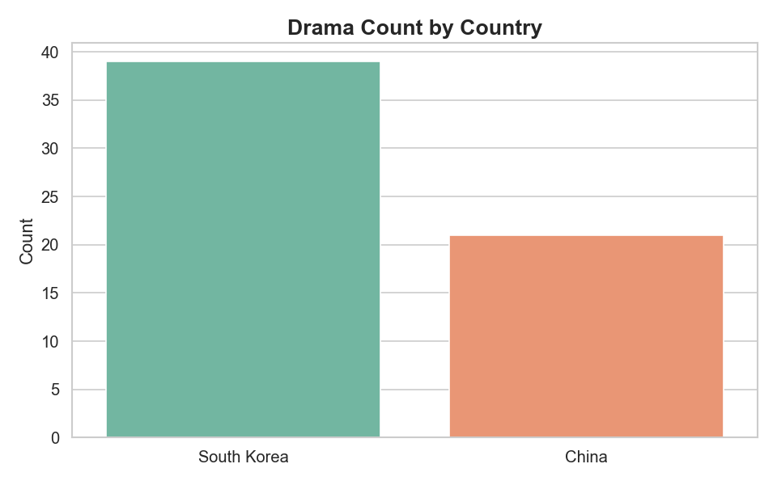
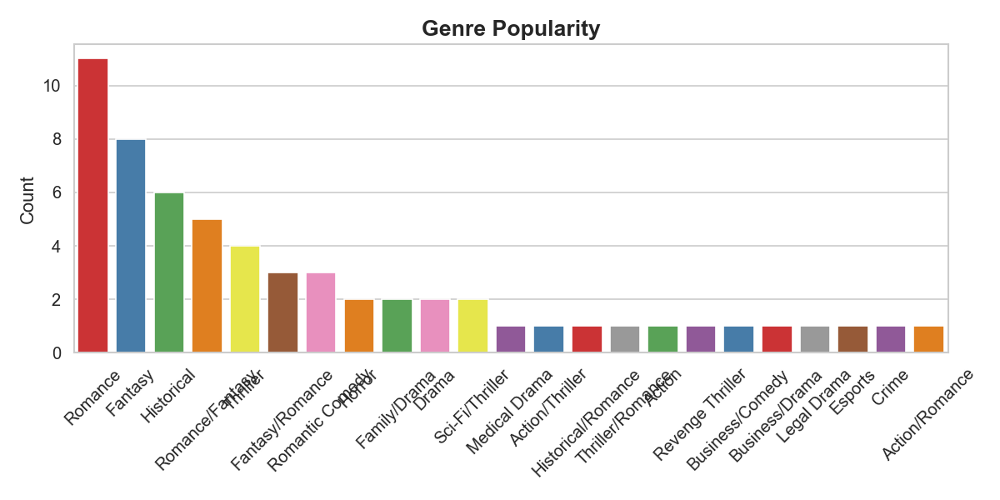
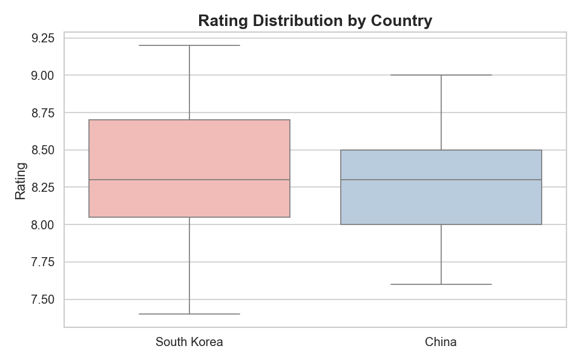

# 📊 KDrama & CDrama Analysis in india .

This project performs data analysis and prediction on a dataset of Korean and Chinese drama.  
It includes:

✅ Data cleaning  
✅ Beautiful visualizations with Seaborn  
✅ A Random Forest model predicting drama ratings  
✅ Feature importance analysis

---

## 🗂️ Project Structure

├── data/
│ └── drama.xlsx ------> Input data(drama excel file)    
├── output/      ------> Plots generated by analysis    
├── scripts/
│ └── analyze_and_predict.py -----> Main analysis script         
├── requirements.txt        ------> libraries includes         
├── .gitignore    ----->Files to ignore in Git                   

## 🧰 Tech Stack

| Technology       | Purpose                                   |
|------------------|-------------------------------------------|
| 🐍 **Python 3**      | Main programming language               |
| 🧮 **pandas**        | Data cleaning and manipulation         |
| 📈 **matplotlib**    | Plotting basic charts                  |
| 🎨 **seaborn**       | Beautiful statistical visualizations   |
| 🧠 **scikit-learn**  | Machine learning model training        |
| 📊 **openpyxl**      | Read Excel files                       |
| 📝 **VS Code**       | Code editing                           |
| 🌐 **Git & GitHub**  | Version control and collaboration      |

## 🖼️ Example Visualizations

Below are some sample outputs generated by the analysis script:

---

### 🎯 Drama Count by Country

---

### 🎭 Genre Popularity

---

### ⭐ Rating Distribution by Country

---

### 🧠 Feature Importance

## 🚀 How to Run the Project Locally

1️⃣ Clone the Repository

'''git clone https://github.com/priyankabhandari22/KCdrama-analysis.git
cd kdrama-cdrama-analysis''''

## ✨ Author
**Name : Priyanka bhandari**

***GitHub : priyankabhandari22***
